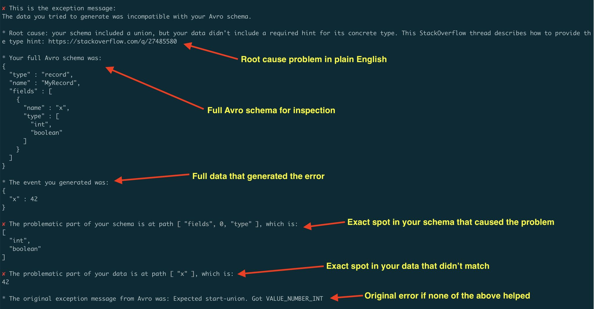

# avro-explain

avro-explain provides better Avro error messages.



Some before/after examples:

old | new
---------
Expected int. Got VALUE_STRING | the data type you generated didn't match your schema. Expected type integer, but found type string.
Unknown union branch not-a-type | expected union type hints #{"boolean" "int"}, but found hints #{"not-a-type"} that don't match.
Expected record-start. Got VALUE_NUMBER_INT | the data you generated wasn't a map type to match the record schema.
Expected start-union. Got END_OBJECT | this record is missing required field x. This StackOverflow answer describes required fields and defaults: https://stackoverflow.com/a/63176493
Expected start-union. Got VALUE_STRING | your schema included a union, but your data didn't include a required hint for its concrete type. This StackOverflow thread describes how to provide the type hint: https://stackoverflow.com/q/27485580

## Rationale

[Avro](https://avro.apache.org/) is a widely used serialization format, especially in the Apache Kafka ecosytem. Despite its prevalence, it can often produce cryptic errors when things go wrong, especially when used with Generic Data.

For example, if you were to incorrectly serialized data against a deeply nested schema, you might see an error message such as: `Expected start-union. Got VALUE_NUMBER_INT`

These error messages lack context. Namely, you don't know:
- Where the error is in your data
- Where the mismatch is in your schema
- What that means in plain English

avro-explain is a tiny Java library with only one method: `org.clojars.mjdrogalis.avroexplain.ExplainAvro/explain()`.

When you encounter an error with Avro, invoke `explain` and pass it your schema and data. `avro-explain` will do a depth-first traversal to intercept the error and return more context to help you understand what's going on.

## Usage

Add the Clojars repository to your project:

```xml
<repositories>
  <repository>
    <id>clojars</id>
    <url>https://repo.clojars.org/</url>
  </repository>
</repositories>
```

Then add the dependency:

```xml

<dependency>
  <groupId>org.clojars.mjdrogalis</groupId>
  <artifactId>avro-explain</artifactId>
  <version>0.1.0</version>
</dependency>
```

Then, invoke `org.clojars.mjdrogalis.avroexplain.ExplainAvro/explain()`.

`explain` takes two arguments: a schema and a matching piece of data.

```java
import org.apache.avro.Schema;
import org.apache.avro.SchemaBuilder;

import org.clojars.mjdrogalis.avroexplain.ExplainAvro;
import org.clojars.mjdrogalis.avroexplain.Explanation;

import java.util.Map;
import java.util.HashMap;

public class Runner {

    public static void main(String[] args) {
        Schema schema = SchemaBuilder
            .record("PageView")
            .namespace("com.example.analytics")
            .fields()
                .name("userId").type().stringType().noDefault()
                .name("url").type().stringType().noDefault()
                .name("durationSeconds")
                    .type().unionOf().nullType().and().floatType().endUnion()
                    .nullDefault()
            .endRecord();

        Map<String, Object> data = new HashMap<>();
        data.put("userId", "user-123");
        data.put("url", "https://example.com/home");
        data.put("durationSeconds", 12.5f);

        Explanation exp = ExplainAvro.explain(schema, data);

        System.out.println("Reason: " + exp.getReason());
        System.out.println("Root cause: " + exp.getRootCause());

        System.out.println("Sub schema: " + exp.getSubSchema());
        System.out.println("Schema path: " + exp.getSchemaPath());

        System.out.println("Sub data: " + exp.getSubData());
        System.out.println("Data path: " + exp.getDataPath());
    }

}
```

`explain` will return a `org.clojars.mjdrogalis.avroexplain.Explanation` object, which has a handful of getter methods to construct a better error message:

- reason: a type of problem encountered
- root cause: a longer description of the problem
- sub schema: the most specific part of your Avro schema that is mismatched with your data
- schema path: a list of keys to navigate into your schema and produce the sub schema
- sub data: the most specific part of your data that is mismatched with your schema
- data path: a list of keys to navigate into your data and produce the sub data

For example, printing out context for the above error, we see:

```
Reason: missing-union-hint
Root cause: your schema included a union, but your data didn't include a required hint for its concrete type. This StackOverflow thread describes how to provide the type hint: https://stackoverflow.com/q/27485580
Sub schema: [null, float]
Schema path: [fields, 2, type]
Sub data: 12.5
Data path: [durationSeconds]
```

## License

Copyright © 2025 Michael Drogalis

This program and the accompanying materials are made available under the
terms of the Eclipse Public License 2.0 which is available at
http://www.eclipse.org/legal/epl-2.0.

This Source Code may also be made available under the following Secondary
Licenses when the conditions for such availability set forth in the Eclipse
Public License, v. 2.0 are satisfied: GNU General Public License as published by
the Free Software Foundation, either version 2 of the License, or (at your
option) any later version, with the GNU Classpath Exception which is available
at https://www.gnu.org/software/classpath/license.html.
